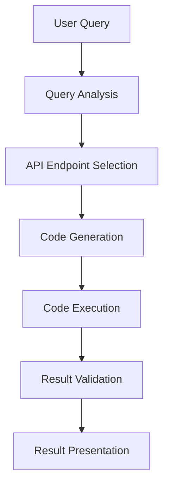

# HubSpot API Agent

A conversational interface that allows users to interact with the HubSpot API using natural language. This tool simplifies complex API interactions and makes HubSpot data accessible without requiring technical expertise.

## Features

- **Natural Language Interface**: Ask questions about your HubSpot data in plain English
- **Code Generation**: Automatically generates the necessary API calls based on your requests
- **Error Handling**: Robust error detection and validation to ensure reliable execution
- **Interactive UI**: Clean, responsive interface with collapsible message sections
- **Dark/Light Mode Support**: Adjustable theme based on your preference

## How It Works

The HubSpot API Agent works through a multi-step process:

1. **User Query**: You describe what HubSpot data you need in natural language
2. **Query Analysis**: The system identifies required HubSpot endpoints and parameters
3. **Code Generation**: JavaScript code is automatically generated to make the appropriate API calls
4. **Code Execution**: The code runs against the HubSpot API with your authorization token
5. **Result Validation**: The system verifies that the results match your request
6. **Result Presentation**: Data is presented in a readable format

## Use Cases

- **Marketing Teams**: Analyze campaign performance and customer data
- **Sales Teams**: Track deal progress and customer interactions
- **Developers**: Prototype and test HubSpot API interactions quickly
- **Data Analysts**: Extract and explore HubSpot data without manual API calls

## Security

Your HubSpot API token is used only for executing the requested queries. It's never stored or transmitted beyond the necessary API calls to fulfill your request.

## Getting Started

1. Obtain a HubSpot API token from your HubSpot account
2. Enter your token in the secure field on the application
3. Type a natural language query or select one of the example queries
4. View the results and explore your HubSpot data

## Technologies Used

- **Frontend**: HTML, CSS, JavaScript, Bootstrap 5
- **API Integration**: HubSpot REST API
- **Natural Language Processing**: GPT-4o-mini via LLMFoundry
- **Rendering**: lit-html for efficient DOM updates
- **Code Parsing**: highlight.js for code syntax highlighting

## Development

This application uses modern ES modules and requires no build process. The main components are:

- `index.html`: Application structure and UI
- `script.js`: Core logic and API integration
- External dependencies loaded via CDN

## License

[MIT License](LICENSE)
