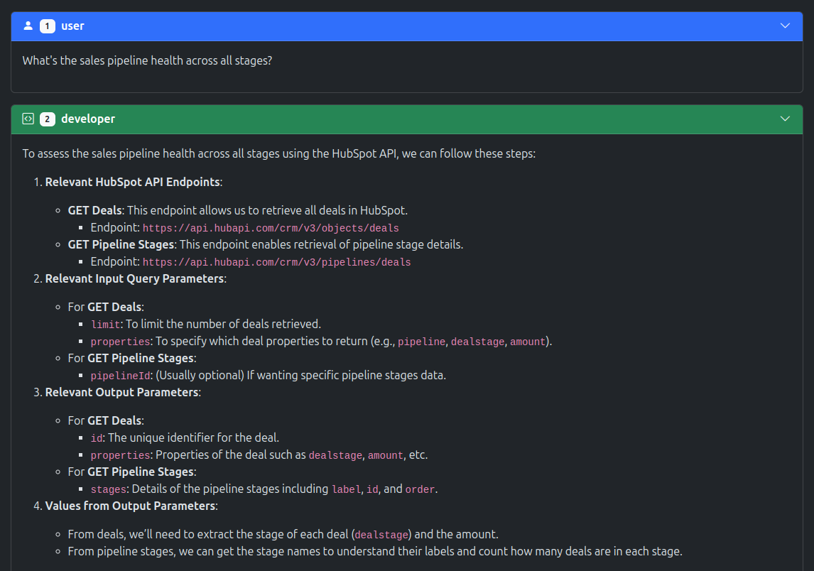

# HubSpot API Agent

A conversational interface that allows users to interact with APIs (like HubSpot) using natural language. This tool simplifies complex API interactions and makes your data accessible without requiring technical expertise.

## Features

- **Natural Language Interface**: Ask questions about your API data in plain English
- **API Card Selection**: Choose from multiple APIs via interactive cards
- **Code Generation & Execution**: Automatically generates and runs the necessary API calls based on your requests
- **Streaming Responses**: See step-by-step progress as the system thinks, generates code, runs it, and validates results
- **Error Handling & Validation**: Robust error detection and validation to ensure reliable execution
- **Interactive UI**: Clean, responsive interface with collapsible message sections and a two-column layout for conversation and results
- **Dark/Light Mode Support**: Adjustable theme based on your preference

## How It Works

The API Agent works through a multi-step, interactive process:

1. **API Selection**: Choose an API by clicking its card. Each card shows the API name, icon, and a brief description.
2. **Token Entry**: Enter your API token in the secure field. A help link is provided for each API.
3. **Ask a Question**: Type a natural language query or select an example question. The system uses LLMFoundry (GPT-4o-mini) to interpret your request.
4. **Step-by-Step Execution**:
    - The system generates code to fulfill your request.
    - The code is executed in-browser with your token.
    - Results are validated for correctness and displayed.
    - Each step (user query, code, result, error, validation) is shown as a card in the conversation column, with results aligned in a parallel column.
5. **Result Presentation**: Data is presented in a readable format, including tables for structured data, with syntax highlighting for code and JSON.

### UI/UX Overview

- **Two-Column Layout**: The left column shows the conversation (user, assistant, validation), the right column shows results (tables, JSON, errors) aligned with the relevant step.
- **Collapsible Cards**: Each step/result is a Bootstrap card that can be expanded/collapsed.
- **Scroll Sync**: Scrolling through conversation steps highlights the corresponding result.
- **Responsive Design**: Works on desktop and mobile, with layout adapting for smaller screens.
- **Dark/Light Mode**: Toggle theme using the navbar control.

## Technologies Used

- **Frontend**: HTML, CSS, JavaScript, Bootstrap 5, Bootstrap Icons
- **Rendering**: [lit-html](https://lit.dev/) for efficient DOM updates
- **Code Parsing**: [highlight.js](https://highlightjs.org/) for code syntax highlighting
- **Markdown Parsing**: [marked](https://marked.js.org/) for rendering markdown content
- **Streaming LLM**: [asyncllm](https://www.npmjs.com/package/asyncllm) for streaming LLM responses from LLMFoundry
- **API Integration**: Supports any REST API (e.g., HubSpot) via dynamic code generation and execution

## Security

Your API token is used only for executing the requested queries. It's never stored or transmitted beyond the necessary API calls to fulfill your request.

## Getting Started

1. Obtain an API token from your account (e.g., HubSpot, or other supported APIs)
2. Open the application in your browser
3. Select the API you want to use by clicking its card
4. Enter your token in the secure field
5. Type a natural language query or select an example question
6. View the results and explore your data interactively

## Development

This application uses modern ES modules and requires no build process. The main components are:

- `index.html`: Application structure, UI, and layout
- `script.js`: Core logic, API integration, dynamic rendering, and LLM interaction
- `config.json`: (Optional) List of supported APIs and their configuration
- External dependencies loaded via CDN (no local install required)

### Key Implementation Details

- **Login Flow**: Uses LLMFoundry authentication for access to the LLM API. If not logged in, prompts the user to log in.
- **Dynamic API Cards**: Renders API options from `config.json`.
- **Streaming LLM**: Uses `asyncllm` to stream LLM responses for a responsive experience.
- **Code Execution**: Generated code is run in-browser using dynamic module imports and the user's token.
- **Validation**: Each result is validated by the LLM to ensure correctness and completeness.
- **Table Rendering**: JSON results are automatically rendered as tables for easy viewing.

## License

[MIT License](LICENSE)
